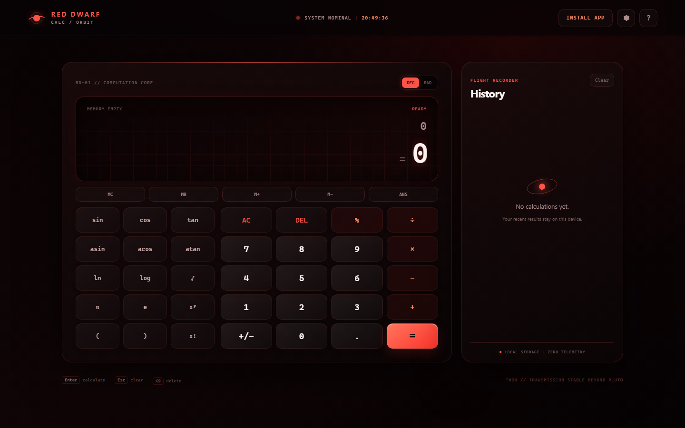

# Red Dwarf · Web Calculator

<p align="center">
  
</p>

<p align="center">
  <strong>A fast, private scientific calculator born in the orbit of a red dwarf.</strong>
</p>

<p align="center">
  <a href="https://sofoste93.github.io/web-calculator-tool/"><strong>Launch the calculator</strong></a>
  ·
  <a href="https://github.com/sofoste93/web-calculator-tool/releases/latest">Download</a>
  ·
  <a href="#keyboard-controls">Keyboard controls</a>
</p>



## From dream to orbit

The original repository contained only an idea. Version 1.0 turns it into a complete scientific calculator that works in a browser, installs like an app and keeps working offline.

- Safe expression parser with no `eval` or remote calculation service
- Standard arithmetic, parentheses and implicit multiplication such as `2π` or `2(3 + 4)`
- Powers, roots, percentages, factorials and logarithms
- Trigonometry in degree and radian modes
- Live result preview, reusable answers and persistent memory
- Local calculation history with one-click recall
- Complete keyboard support and responsive phone layout
- Installable PWA with offline cache
- Local-only preferences and data with zero analytics
- Accessible controls, reduced-motion option and clear error feedback

## Use it

Open the live application at [sofoste93.github.io/web-calculator-tool](https://sofoste93.github.io/web-calculator-tool/). Use the browser install action or the **Install app** button to keep Red Dwarf on your desktop or phone.

You can also download the standalone web bundle from [GitHub Releases](https://github.com/sofoste93/web-calculator-tool/releases/latest), extract it and serve the directory with any static web server.

## Keyboard controls

| Key | Action |
|---|---|
| `0–9`, `.`, operators | Enter an expression |
| `Enter` or `=` | Calculate |
| `Backspace` / `Delete` | Remove the last character |
| `Escape` | Clear the expression |
| `P` | Insert π |

## Privacy

Calculations never leave the device. History, memory and settings use browser local storage. The application has no account, cookies, trackers, advertisements or runtime dependencies.

To erase local data, clear the flight recorder inside the app and remove the site data through the browser. Memory and settings can also be reset by clearing local storage.

## Development

Red Dwarf uses standards-based HTML, CSS and JavaScript with no build step and no production dependencies. Node.js 20 or newer is only needed to run the verification suite.

```bash
npm test
npm run check
```

Serve the repository through any static server:

```bash
npx serve .
```

The calculation engine lives in `engine.js` and is covered by Node's built-in test runner. GitHub Actions tests every change, deploys `main` to Pages and publishes versioned offline bundles for release tags.

## License

Copyright © 2026 Stephane Sob Fouodji. Released under the [Apache License 2.0](LICENSE).

**THOR // transmission stable beyond Pluto.** 🔴🛰️
